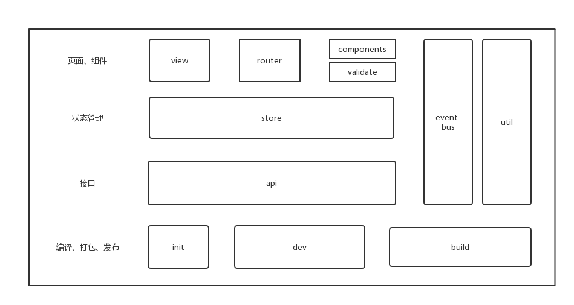

# 客户端开发向导

> 2018-6-11 

文中会介绍项目关键技术选型，架构设计，demo演示，以争取让开发成员尽快熟悉项目，上手开发。

Feature：

- 一个SPA应用
- 通过cli工具搭建的项目
- vuex集中管理状态
- 使用element组件
- 支持ES6

### 技术选型

项目特点和面临的问题：

- 项目一期开发周期短，时间非常有限
- 项目页面少，业务逻辑较复杂，考虑项目后续的可扩展性，代码可维护行

选择了Vue这个mvvm框架，主要原因：  

- 上手简单，新成员学习曲线平滑
- 项目生态完整，各种周边资源丰富，ele\iview\validate\webpack

###### 相关依赖
基本使用了Vue全家桶

- vuex - 集中式状态管理库
- vue-router - 单页应用必备前端路由，适合频繁切换页面，避免重复加载
- axios - vue 官方推荐http工具
- vue-cli - 基于webpack模板
- element-ui - 基于vue的组件库

### 开发规范
###### 命名规范
- 命名风格：驼峰式命名作为通用的声明约定，短横线分隔命名作为通用的使用约定，下划线分隔命名作为通用的文件命名约定
- 有意义的名词、简短、具有可读性
- 文件夹主要以功能模块划分，以具代表性功能模块命名

###### 结构化规范
- 目录结构，基于Vue-cli脚手架搭建而成的目录风格

	├── README.md  
	├── build                   
	├── config                
	├── dist                   
	├── index.html           
	├── package.json
	├── src                     
	│   ├── App.vue            
	│   ├── assets             
	│   ├── components          
	│   ├── main.js             
	│   ├── common              
	│   ├── store               
	│   └── layout              
	├── static               
	└── test  

- vue单文件组件结构  

###### 注释规范

代码注释在一个项目的后期维护中显的尤为重要，所以我们要为每一个被复用的组件编写组件使用说明，为组件中每一个方法编写方法说明。  
1. 公共组件使用说明  
2. 各组件中重要函数或者类说明  
3. 复杂的业务逻辑处理说明  
4. 特殊情况的代码处理说明,对于代码中特殊用途的变量、存在临界值、函数中使用的hack、使用了某种算法或思路等需要进行注释描述  
5. 注释块必须以/\*\*（至少两个星号）开头\*\*/；  
6. 单行注释使用//；  
 
 ###### 编码规范
 优秀的项目源码，即使是多人开发，看代码也如出一人之手。统一的编码规范，可使代码更易于阅读，易于理解，易于维护。  
 **尽量按照ESLint格式要求编写代码**

### 架构设计

###### 整体架构图

###### 目录结构

	├── README.md  
	├── build                   # build 脚本  
	├── config                  # prod/dev build config 文件
	├── dist                    # 发布目录
	├── index.html              # 最基础的网页
	├── package.json
	├── src                     # Vue.js 核心业务
	│   ├── App.vue             # App Root Component
	│   ├── assets              # 用在vue结构中的图片资源
	│   ├── components          # 通用组件,输入框/日期框/下拉框/表格/表单等
	│   ├── main.js             # Vue 入口文件
	│   ├── common              # 公用工具，http、router、util等
	│   ├── store               # 全局状态数据,按模块划分
	│   └── layout              # 布局组件,跟具体业务相关的页面组件,按功能模块分类
	│   └── setting             # 快速配置,可以快速配置出各个功能模块的字段说明/列表字段/显示布局/表单布局/验证规则等（预留）
	│   └── validator           # 额外的验证组件（预留）
	├── static                  # 因无法纳入vue而独立存在的css js 图片等资源
	└── test                    # 测试

###### 页面组件  

页面组件按模块组织，在layout下,公共组件放在components下。

###### 状态管理  

使用VUEX集中管理状态，注意VUEX使用规范。在store目录下，按模块组织，包括改变状态，api访问。
- 数据处理逻辑尽量写在组件内（将来可以考虑抽取到单独的service层）
- mutation内，只负责改变state相关操作
- action内，只负责api访问获取数据

###### event-bus 事件总线  

全局性的事件总线，用于处理一些VUEX无法满足的特殊需求

### Demo

接下来，以帐号管理模块的用户列表，用户添加模块的列表显示功能为例，介绍一个典型功能的开发流程，如图：

###### 第一步，创建页面组件

根据开发规范中的命名规范和结构规范，在layout下，创建user目录，分别创建user_index.vue,user_list.vue,user_form.vue三个文件，根据vue单文件组件基本结构，编写好这三个文件的基本内容。 

- user_index.vue 为该模块总入口组件  
- user_list.vue 为列表组件  
- user_form.vue 为添加用户的表单组件  

###### 第二步，添加菜单项，添加路由信息

在layout/common/page_menu.vue中根据规则添加一个菜单项，并在common/router.js内添加一条路由信息与之对应，使该菜单项生效。  
  

###### 第三步，vuex状态管理  

- 在store内，添加user.js文件，内容为标准vuex文件结构，state、getter、mutation、action。    
- 在store/index.js文件内，导入user.js,是模块化组织的状态仓库纳入vuex的管理。  
- 编写user.js内容。  

###### 第四步，组件内使用状态

可以通过mapGetters来映射state到组件内，可以通过dispatch调用action方法来获取state，通过commit调用mutation方法来更新state。  
  

###### 第五步，完善逻辑

反复第三，第四步骤，完善数据，状态处理逻辑。   

**到此，一个基本的用户列表显示功能就完成了。**

